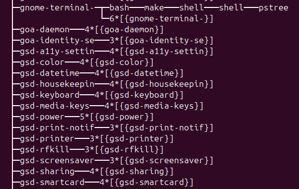

# Kushal's Custom Shell

A lightweight and simple custom shell implementation in C. This shell supports basic shell commands, input/output redirection, and a few built-in commands (`cd`, `help`, `exit`).

## Features

- **Built-in Commands:**
  - `cd`: Change the current working directory.
  - `help`: Display information about the shell and its commands.
  - `exit`: Exit the shell.

- **Command Execution:**
  - Supports execution of non-built-in commands using `execvp`.

- **I/O Redirection:**
  - Redirect standard input/output using `<` and `>`.

- **Error Handling:**
  - Displays appropriate error messages for invalid commands or file operations.


## Build and Run the file

1. Clone the repository:
   ```bash
   git clone <repository-url>
   cd <repository-directory>
   ```

2. Compile and Run the shell :
   ```bash
   make
   ```

## Process tree visualization

